<table>
<tr>
<td valign="top"></td>
<td valign="top"></td>
</tr>
</table>

## Prajwal Shinde

**Full Stack Developer · AI Engineer · Computer Engineering Student**

 

<!-- animated contribution graph, refreshed daily by the workflow -->

